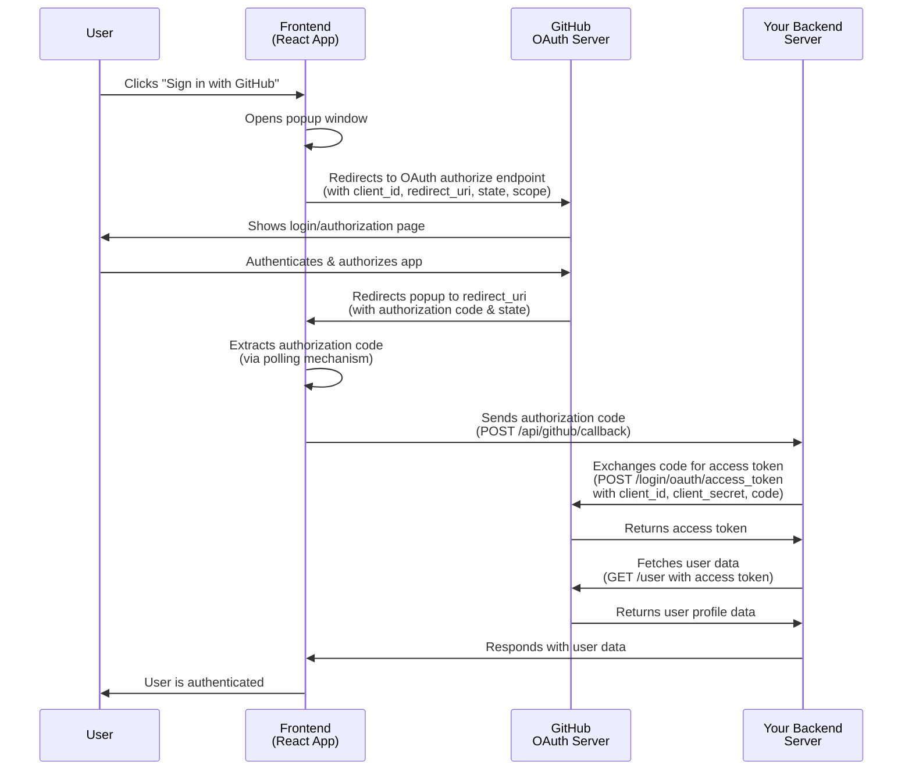

<div align="center">
<h1>@react-oauth/github</h1>

**A modern, production-grade React hook for GitHub OAuth authentication**

</div>

---

## Features

- ✅ **Production-Ready** - Battle-tested and optimized for real-world applications
- ✅ **Fully Typed** - Complete TypeScript support with exported types
- ✅ **Zero Dependencies** - No runtime dependencies (only React peer deps)
- ✅ **Flexible API** - Custom hook for complete UI control
- ✅ **Well Documented** - Extensive documentation and examples

## Quick Start

### Installation

```bash
npm install @react-oauth/github
# or
yarn add @react-oauth/github
# or
pnpm add @react-oauth/github
```

### Basic Usage

```tsx
import { useGitHubLogin } from '@react-oauth/github';

function CustomLoginButton() {
  const { initiateGitHubLogin, isLoading } = useGitHubLogin({
    clientId: 'your-github-client-id',
    redirectUri: 'http://localhost:3000/callback',
    onSuccess: response => {
      console.log('Authorization code:', response.code);
    },
    onError: error => {
      console.error('Authentication failed:', error);
    },
  });

  return (
    <button onClick={initiateGitHubLogin} disabled={isLoading}>
      {isLoading ? 'Loading...' : 'Sign in with GitHub'}
    </button>
  );
}
```

## API Reference

### `useGitHubLogin` Hook

A custom React hook that provides GitHub OAuth functionality. Use this when you want complete control over your UI. All options, including callbacks, are passed in a single object.

#### Parameters

```typescript
useGitHubLogin(options: UseGitHubLoginOptions): UseGitHubLoginReturn
```

#### Options

| Option         | Type                                | Required | Default        | Description                                                          |
| -------------- | ----------------------------------- | -------- | -------------- | -------------------------------------------------------------------- |
| `clientId`     | `string`                            | ✅       | -              | Your GitHub OAuth App Client ID                                      |
| `onSuccess`    | `(response: OAuthResponse) => void` | ✅       | -              | Callback called when authentication succeeds                         |
| `onError`      | `(error: Error) => void`            | ✅       | -              | Callback called when authentication fails                            |
| `redirectUri`  | `string`                            | ❌       | `''`           | Registered redirect URI for your OAuth App                           |
| `scope`        | `string`                            | ❌       | `'user:email'` | OAuth scopes to request (comma-separated)                            |
| `popupOptions` | `PopupWindowOptions`                | ❌       | -              | Options for configuring the popup window                             |
| `state`        | `string`                            | ❌       | Auto-generated | State parameter for CSRF protection (auto-generated if not provided) |
| `allowSignup`  | `boolean`                           | ❌       | `true`         | Whether to allow signup during authentication                        |
| `onRequest`    | `() => void`                        | ❌       | -              | Optional callback called when OAuth flow is initiated                |

#### Return Value

```typescript
{
  initiateGitHubLogin: () => void;  // Function to initiate OAuth flow
  isLoading: boolean;                // Loading state during authentication
}
```

#### Types

```typescript
interface OAuthResponse {
  code: string;
  state?: string;
  error?: string;
  error_description?: string;
}

interface PopupWindowOptions {
  height?: number;
  width?: number;
  left?: number;
  top?: number;
}

interface UseGitHubLoginOptions {
  clientId: string;
  redirectUri?: string;
  scope?: string;
  popupOptions?: PopupWindowOptions;
  state?: string; // Auto-generated if not provided
  allowSignup?: boolean;
  onSuccess: (response: OAuthResponse) => void;
  onError: (error: Error) => void;
  onRequest?: () => void;
}

interface UseGitHubLoginReturn {
  initiateGitHubLogin: () => void;
  isLoading: boolean;
}
```

## Common Scopes

- `user:email` - Read user email addresses (default)
- `repo` - Full control of private repositories
- `read:org` - Read org and team membership
- `gist` - Create gists
- `notifications` - Access notifications

See [GitHub OAuth Scopes](https://docs.github.com/en/developers/apps/building-oauth-apps/scopes-for-oauth-apps) for the full list.

## Error Handling

The hook provides comprehensive error handling with standardized error codes. All OAuth-related errors are `Error` objects with a `code` property containing specific error codes:

### Error Codes

| Code    | Description                                                                               |
| ------- | ----------------------------------------------------------------------------------------- |
| `OA001` | The Popup Closed - User closed the popup window before completing authentication          |
| `OA002` | Popup Blocked By Browser - Browser blocked the popup window (user needs to enable popups) |
| `OA003` | State Mismatch - State parameter mismatch detected (possible CSRF attack)                 |
| `OA004` | Missing Code - Authorization code not found in OAuth response                             |

### Usage

```tsx
import {
  useGitHubLogin,
  OAuthError,
  OAuthErrorCode,
} from '@react-oauth/github';

function LoginButton() {
  const { initiateGitHubLogin, isLoading } = useGitHubLogin({
    clientId: 'your-client-id',
    onSuccess: handleSuccess,
    onError: error => {
      if (OAuthError.isOAuthError(error)) {
        switch (error.code) {
          case OAuthErrorCode.POPUP_CLOSED:
            console.log('User closed the popup');
            // Handle popup closed
            break;
          case OAuthErrorCode.POPUP_BLOCKED:
            console.log('Popup blocked by browser');
            // Prompt user to enable popups
            break;
          case OAuthErrorCode.STATE_MISMATCH:
            console.log('State mismatch - possible CSRF attack');
            // Handle security issue
            break;
          case OAuthErrorCode.MISSING_CODE:
            console.log('Authorization code not found in response');
            // Handle missing code
            break;
          default:
            console.log('Other OAuth error:', error.message);
        }
      } else {
        // Handle other errors
        console.error('Unexpected error:', error);
      }
    },
  });

  return (
    <button onClick={initiateGitHubLogin} disabled={isLoading}>
      {isLoading ? 'Loading...' : 'Sign in with GitHub'}
    </button>
  );
}
```

### Error Object Structure

```typescript
type OAuthError = Error & {
  code: OAuthErrorCode; // Error code (e.g., "OA001")
};
```

## CSRF Protection

The package automatically generates a state parameter for CSRF protection if you don't provide one. The state is verified when the OAuth callback returns. If you provide your own state, make sure to verify it matches in your `onSuccess` callback:

```tsx
const { initiateGitHubLogin } = useGitHubLogin({
  clientId: 'your-client-id',
  state: 'your-custom-state', // Optional - auto-generated if not provided
  onSuccess: response => {
    // State is automatically verified by the package
    // But you can also verify it manually if needed
    if (response.state === 'your-custom-state') {
      // Proceed with authentication
    }
  },
  onError: error => console.error(error),
});
```

## How It Works

This package implements the **OAuth 2.0 Authorization Code Flow** with a popup window. The flow ensures secure authentication by keeping sensitive credentials (like the Client Secret) on your backend.



### Key Points

- **Authorization Code**: The temporary code returned by GitHub is called an "authorization code" (not an access token)
- **Security**: The Client Secret never leaves your backend - the code exchange happens server-side
- **Popup Flow**: Uses a popup window with polling to detect when GitHub redirects back
- **State Parameter**: Automatically generated for CSRF protection

## Setup

### 1. Create a GitHub OAuth App

1. Go to [GitHub Developer Settings](https://github.com/settings/developers)
2. Click "New OAuth App"
3. Fill in the application details:
   - **Application name**: Your app name
   - **Homepage URL**: Your app URL
   - **Authorization callback URL**: Your redirect URI (e.g., `http://localhost:3000/callback`)
4. Click "Register application"
5. Copy the **Client ID** (you'll need this for the hook)

### 2. Exchange Authorization Code for Access Token

The hook returns an authorization `code` that you need to exchange for an access token on your backend. **Never exchange the code on the client side** - this requires your Client Secret.

**Backend Example (Node.js/Express):**

```javascript
app.post('/api/github/callback', async (req, res) => {
  const { code } = req.body;

  const response = await fetch('https://github.com/login/oauth/access_token', {
    method: 'POST',
    headers: {
      'Content-Type': 'application/json',
      Accept: 'application/json',
    },
    body: JSON.stringify({
      client_id: process.env.GITHUB_CLIENT_ID,
      client_secret: process.env.GITHUB_CLIENT_SECRET,
      code,
    }),
  });

  const data = await response.json();
  const { access_token } = data;

  // Use access_token to fetch user data
  const userResponse = await fetch('https://api.github.com/user', {
    headers: {
      Authorization: `token ${access_token}`,
    },
  });

  const user = await userResponse.json();
  // Handle user authentication...
});
```

## License

MIT

---

<div align="center">
Made with ❤️ for the React community
</div>
